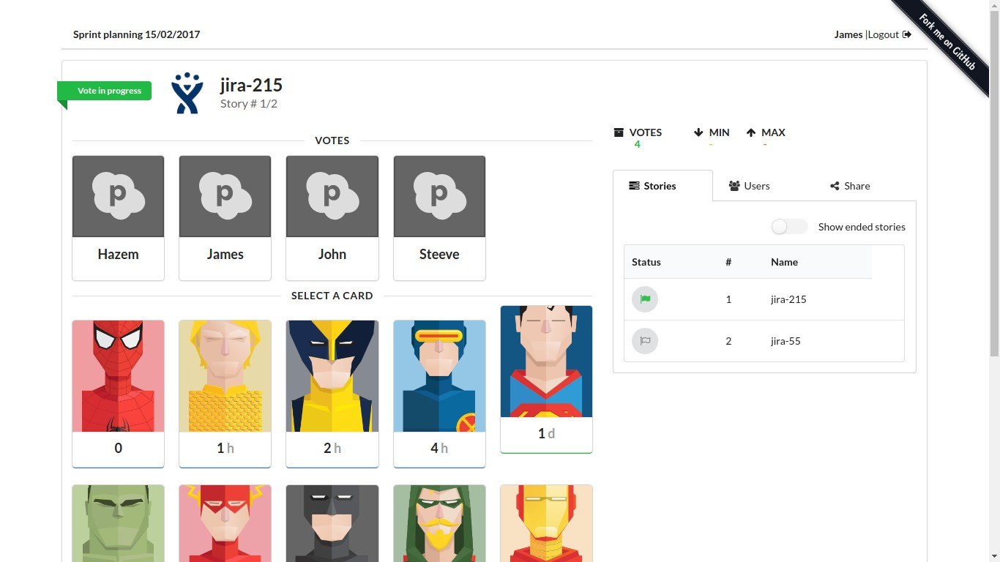
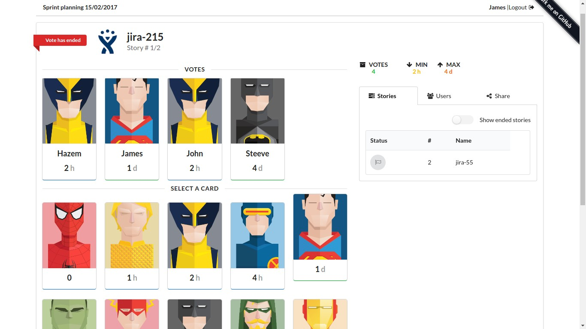

[](https://codecov.io/gh/Hazem-Ben-Khalfallah/scrum-poker-planning) [](https://travis-ci.org/Hazem-Ben-Khalfallah/scrum-poker-planning)

# Scrum Poker application
Vote your stories instantly & get the result in a blink!

Scrum Poker is a powerful tool to make faster and more accurate estimations and most important of all, no developer influences his team mates!

This app can be used in scrum poker planning sessions anywhere. It includes the numbered cards along with Pass, break and ? cards. 3 types of cards set can be selected when creating a voting session.

## Demo
You are welcome to use this free app on: 
http://pokerscrum.herokuapp.com/

## Snapshots
- Configure Poker Planning stories


- Voting session



- Results after ending Votes



## War file generation for Openshift
For all WebSocket connections on OpenShift, you need to use port 8000 (for Secured sessions it would be 8443).
you should generate a war file using following command.
```bash
mvn clean install -Dconfigure.ws=8000 -Dconfigure.wss=8443
```

## Developed by
- Hazem Ben Khalfallah
- Khaireddine Rezgui

## Credits
Special thanks to Redbooth team for their creative card set.
https://github.com/redbooth/Scrum-poker-cards