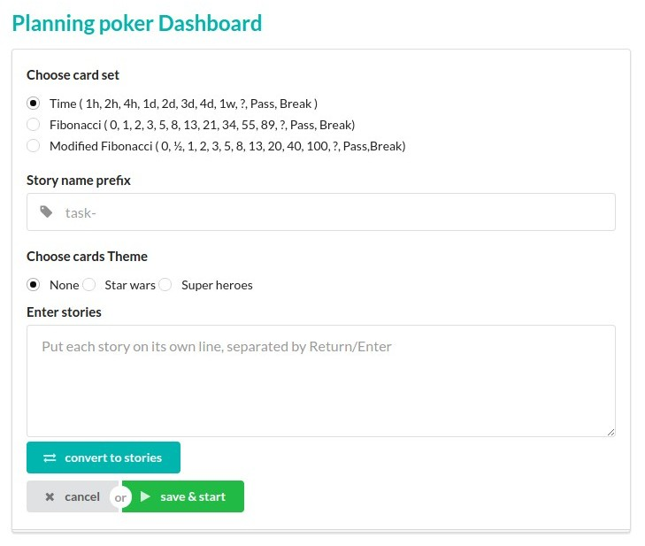

[](https://codecov.io/gh/Hazem-Ben-Khalfallah/scrum-poker-planning) 
[](https://travis-ci.org/Hazem-Ben-Khalfallah/scrum-poker-planning)
[](https://codeclimate.com/github/Hazem-Ben-Khalfallah/scrum-poker-planning/maintainability)


# Scrum Poker application
Vote your stories instantly & get the result in a blink!

Scrum Poker is a powerful tool to make faster and more accurate estimations and most important of all, no developer influences his team mates!

This app can be used in scrum poker planning sessions anywhere. It includes the numbered cards along with Pass, break and ? cards. 3 types of cards set can be selected when creating a voting session.

## Demo
You are welcome to use this free app on: 
http://pokerscrum.herokuapp.com/

## How to run locally
### Prerequisites 
- **Docker** & **Docker Compose**: [How to install Docker compose?](https://docs.docker.com/compose/install/)

### Build and Run 
1- Use docker compose to build a docker image and run the app in a container
```bash
docker-compose up
```

2- Open your preferred browser and go to [localhost:28080](localhost:28080) 

## How to use this app
1- In login page, click on **New Session** button to configure a new Poker planning session

2- Configure your new Poker planning session
* select you voting cards type
    * **Time**: to estimate time in hours, days ...
    * **Fibonacci**: to estimate your stories based on story points using Fibonacci sequence numbers
    * **Modified Fibonacci**: to estimate your stories based on story points Modified Fibonacci sequence numbers
* *[Optional]* configure a suffix to your stories names. For example, if you set the value of this field to *jira-*, all the stories that will be created next well be named *jira-xxx*.
* *[Optional]* select a card theme. It makes the voting funnier!
* *[Optional]* If you already know your stories ids or names before starting the voting session, you can enter them in the text area.
Don't forget to click on **Convert to stories** button to generate the stories.



3- After finishing the configuration, you can click on **save & start** button to start the new session. You'll be asked to enter your name that will be displayed during the voting session.

4- You should be redirected to the Poker planning session dashboard where your team members can cast their votes. 
In order to let them join your new session, you should send them the session Id.


5- If you have not already created stories in configuration step, you can add a story name or id by entering a value in the following inputText. 
A new task will be added into the list with the prefix defined in the configuration step. 


6- Every team member can cast a vote if they click on a story from the list and select a card. Votes can be changed until the voting session has been ended manually by the session admin.


7- When everyone has finished voting, the session admin (the user who have created and configured the session) can stop the voting by clicking on **End vote** button. 
Results will be revealed to everyone right after that.


## War file generation for Openshift
For all WebSocket connections on OpenShift, you need to use port 8000 (for Secured sessions it would be 8443).
you should generate a war file using following command.
```bash
mvn clean install -Dconfigure.ws=8000 -Dconfigure.wss=8443
```

## Developed by
- Hazem Ben Khalfallah
- Khaireddine Rezgui

## Credits
Special thanks to Redbooth team for their [creative card set](https://github.com/redbooth/Scrum-poker-cards).

Chris Aguilar for his [vector playing cards](https://sourceforge.net/projects/vector-cards/).
